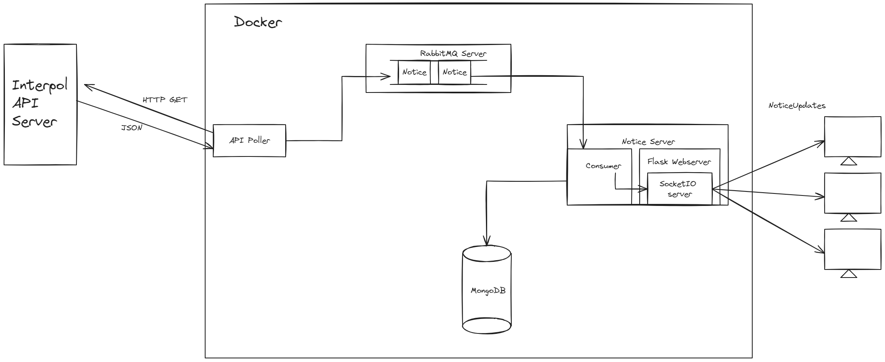

# Interpol-Red-DL


`interpol-red-dl` is a project designed to download and display data published by Interpol on wanted persons. It primarily consists of two Dockerized applications: `api_poller` and `notice_server`.  
`api_poller` periodically retrieves notices on wanted persons from the Interpol API and sends it to the message broker queue.  
`notice_server` reads notices from the queue, stores it in a database, and includes a web server to display information about wanted persons in real-time.

## Usage

### Prerequisites
Ensure that Docker Engine is installed on your system.

### Running Interpol-Red-DL
To build and start the dockerized applications in detached mode, use the command:
```bash
docker-compose up --build -d
```
### Stopping Interpol-Red-DL
To stop the application and remove the containers, use the command:
```bash
docker-compose down
```
### Testing
To run the tests, use the commands:
```bash
# Run tests for api_poller:
docker-compose run api_poller pytest

# Run tests for notice_server
docker-compose run notice_server pytest
```

## Configuration Options
### Environment Variables
#### api_poller.env
Stores configuration options specific to `api_poller` application:
| Name                    | Description                                                |
| ----------------------- | ---------------------------------------------------------- |
| `RED_LIST_URL`          | URL to Red List API endpoint                           |
| `API_RATE_LIMIT_DELAY`  | Delay in seconds between each fetched notice           |
| `POLL_INTERVAL`         | Delay in seconds between each run of polling           |
| `QUERY_STRATEGY`        | Strategy to be used to query notice lists <br>`0`: `SimpleDefaultSearch`, `1`: `SimpleBruteforceSearch` |


#### notice_server.env
Stores configuration options specific to `notice_server.env` application:
| Name                    | Description                                                |
| ----------------------- | ---------------------------------------------------------- |
| `DB_NAME`               | The name of database where notices are to be stored        |

#### common.env
Stores configuration options that are shared between multiple docker instances:
| Name                          | Description                                      |
| ----------------------------- | ------------------------------------------------ |
| `QUEUE_NAME`                  | Name of the queue used for fetched notices  |
| `RABBITMQ_HOST`               | Hostname of the RabbitMQ server             |
| `RABBITMQ_PORT`               | Port number on which RabbitMQ server is running |
| `RABBITMQ_DEFAULT_USER`       | Username for RabbitMQ                       |
| `RABBITMQ_DEFAULT_PASS`       | Password for RabbitMQ                       |
| `MONGO_INITDB_ROOT_USERNAME`  | Root username for MongoDB initialization    |
| `MONGO_INITDB_ROOT_PASSWORD`  | Root password for MongoDB initialization    |
| `DB_HOST`                     | Hostname of the MongoDB server              |
| `DB_PORT`                     | Port number on which MongoDB is running     |


#### .env
Stores configuration options for `compose.yaml`:
| Name                          | Description                                              |
| ----------------------------- | ---------------------------------------------------------|
| `WEB_SERVER_HOST_PORT`        | Port number on which web server listens on host machine  |

### Other Configurations
#### Request Headers
Request headers for API requests can be set in this file: `api_poller/config_data/headers.json`

## System Overview


## Notes about Interpol API
- The project is created for demonstration purposes only. Notice data may not be used for any commercial purpose, as stated in [Interpol's Disclaimer](https://www.interpol.int/How-we-work/Notices/Red-Notices/View-Red-Notices)
- Although the Interpol API is publicly available, it appears to be intended for internal use only, with measures to prevent bots.
	- The Interpol API includes User-Agent and other header field validation checks to prevent bots. Therefore `api_poller/config_data/headers.json` file is provided to spoof headers.
	- The Interpol API implements rate-limiting to prevent excessive requests. The `API_RATE_LIMIT_DELAY` configuration option allows for adjustments.
- [Interpol](https://www.interpol.int/How-we-work/Notices/Red-Notices/View-Red-Notices) displays up to 160 notices per search result, advising users to refine search criteria to locate specific notices. However there are approximately 7000 notices in circulation at the time of this project's writing.
	- To address this, a `SimpleBruteforceSearch` strategy has been developed, which bruteforces the search criteria based on a wanted person's nationality and age. This approach is more practical than bruteforcing string-based parameters.